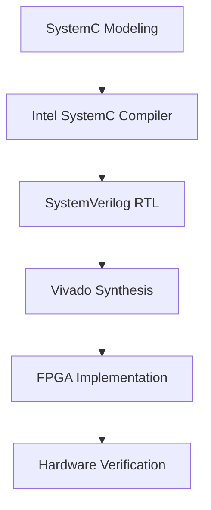

# IEEE 754 Pipelined Floating-Point Unit with SystemC and FPGA Implementation

A comprehensive implementation of an IEEE 754-compliant pipelined floating-point processor using SystemC modeling, high-level synthesis, and FPGA verification on Xilinx Zynq platform.

## 📋 Overview

This project presents a complete design flow for implementing a floating-point processor that supports IEEE 754 standard arithmetic operations (addition, subtraction, multiplication, division) within a four-stage pipeline architecture. The implementation leverages SystemC for high-level modeling and Intel Compiler for SystemC (ICSC) for RTL generation, with final deployment on Xilinx Zynq FPGA.

## 🎯 Key Features

- **IEEE 754 Compliance**: Full support for single-precision (32-bit) floating-point format
- **Pipelined Architecture**: 4-stage pipeline (Fetch, Decode, Execute, Writeback)
- **Complete Arithmetic Suite**: Addition, subtraction, multiplication, and division operations
- **Special Case Handling**: Proper handling of zero, infinity, NaN, and denormalized numbers
- **High-Level Synthesis**: SystemC to SystemVerilog translation using ICSC
- **Comprehensive Verification**: Cross-platform verification with RISC-V Spike simulator

## 🏗️ Architecture

### Pipeline Stages

- **Instruction Fetch (IF)**: Program counter management and instruction memory access
- **Decode (ID)**: Instruction decoding and register file access
- **Execute (EX)**: IEEE 754 floating-point arithmetic operations
- **Writeback (WB)**: Result integration into processor state

### Arithmetic Units

- **IEEE 754 Adder/Subtractor**: 3-stage implementation with proper alignment and normalization
- **IEEE 754 Multiplier**: 3-stage implementation with 24×24-bit significand multiplication
- **IEEE 754 Divider**: Iterative division algorithm with restoring division
- **Exception Handling**: Complete IEEE 754 exception detection and management

## 🛠️ Development Flow



### Prerequisites

- **SystemC Library**: Version 2.3.3 or higher
- **Intel Compiler for SystemC (ICSC)**: Version 1.6.13
- **Xilinx Vivado**: 2019.2 or compatible
- **GCC**: 9.3.0 with C++14 support
- **CMake**: 3.16 or higher

## 🧪 Verification

The project includes comprehensive verification methodology:

- **Functional Verification**: SystemC testbenches with IEEE 754 test vectors
- **Cross-Verification**: Comparison with RISC-V Spike simulator
- **Waveform Analysis**: Detailed signal analysis using GTKWave
- **FPGA Verification**: Hardware-in-the-loop testing on Zynq platform

### Cross-verification with Spike

```bash
# Cross-verify with Spike
spike --isa=rv32f test_program.elf
```

## 🏆 Acknowledgments

- **Friedrich-Alexander-Universität Erlangen-Nürnberg** - Department of Computer Science
- **Prof. Dr.-Ing. Dietmar Fey** - Thesis supervisor
- **Intel Corporation** - SystemC Compiler tools
- **Xilinx Inc.** - FPGA development tools

## 📧 Contact

**Ashwin Varkey** - ashwinvarkey9@gmail.com

---

*This project represents a Master's thesis in Computational Engineering completed at Friedrich-Alexander-Universität Erlangen-Nürnberg in June 2025.*
